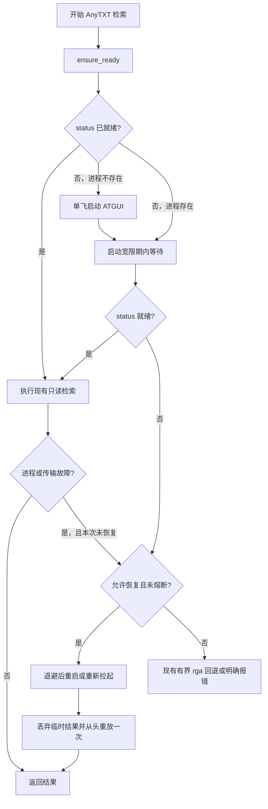

# AnySirchmunk 交接：内置 AnyTXT 进程自愈方案

日期：2026-09-16

分支：`main`　上游基线：Sirchmunk `3c7ee54f93fa198db2020a3ab850356f2dacff72`

## 0. 结论

**建议做，而且可以让 Restart on Crash 不再是 AnySirchmunk 的必需依赖。**

但不建议把 Restart on Crash 原样重写进检索器。更合适的目标是一个只管理 AnyTXT、理解
`anytxt.v1.status`、受重启次数限制的进程监督器：

1. 查询前发现 AnyTXT 未启动时，按需启动 `ATGUI.exe` 并等待 v1 API 真正就绪；
2. 查询中若 AnyTXT 进程退出或本机端口消失，只允许一次受控恢复，然后从头重放本次只读检索；
3. 若用户需要 AnyTXT 全天常驻，再启用同一监督器的可选 `watch` 模式；
4. 协议错误、查询语义错误、未索引目录和预算耗尽绝不通过“重启”掩盖；
5. 以 10 分钟最多 3 次重启的熔断器阻止重启风暴。

首个实现里，`external` 必须保持默认以兼容现有部署；完成真实故障注入验收后，本机再切换到
`on_demand`。常驻 `watch` 是第二阶段，不应阻塞按需自愈上线。

上一版（自动范围探测、30 查询基准及剩余 P3 工作）保存在：

```powershell
git show 6cd4bc5:HANDOFF.md
```

## 1. 本机现状与证据

### 1.1 当前确实依赖 Restart on Crash

2026-09-16 的只读核查：

| 项目 | 当前值 |
| --- | --- |
| Restart on Crash | `D:\Program Files\RestartOnCrash-v1.6.4\RestartOnCrash.exe /hide` |
| 自启动 | 当前用户 `HKCU\Software\Microsoft\Windows\CurrentVersion\Run` 中的 `wsRestartOnCrash` |
| 全局重启宽限期 | 300 秒 |
| AnyTXT 监控目标 | `C:\Program Files\AnyTXT Searcher\ATGUI.exe` |
| 判定条件 | “进程不存在”或“窗口未响应” |
| 未响应时动作 | 终止进程，并关闭 Windows 问题报告窗口 |
| 故障后延迟 | 30 秒再执行启动命令 |
| Restart on Crash 日志 | 当前关闭 |

同一份 `settings.ini` 还监控 `GameViewer.exe`。未来迁移时只能停用 AnyTXT 对应的
`Application1`，**不能卸载或整体停用 Restart on Crash**，否则会破坏用户的另一个监控任务。

Restart on Crash 的官方说明确认了这些核心行为：按进程是否运行或是否响应进行监控、执行自定义重启命令、
以及在刚重启后使用 grace period 避免启动阶段被再次误杀。它还明确指出，“程序未运行”规则会把用户主动退出
也当作崩溃；“终止未响应程序”可能一次杀掉该程序的所有实例。方案只参考这些行为，不复制或分发其程序或代码。

参考：[Restart on Crash 官方说明](https://w-shadow.com/blog/2009/03/04/restart-on-crash/)。

### 1.2 AnyTXT 当前状态

| 项目 | 当前值 |
| --- | --- |
| 进程 | `ATGUI.exe`，PID 9708，父进程为 `explorer.exe` |
| 监听 | `127.0.0.1:9920`、`127.0.0.1:9924` |
| v1 就绪检查 | `anytxt.v1.status` 返回 `errno=0`、`output.return=true` |
| 安装路径 | `C:\Program Files\AnyTXT Searcher\ATGUI.exe` |
| 文件版本 | **1.3.3514.0** |
| SHA-256 | `2EBE2A37B82AE057B272FC3FF6B300E75AEE476EC473EB856DBFDC930A21E716` |

这里发现一个必须先解决的漂移：当前仓库文档和错误消息要求 **1.3.3541+**，但本机实际可执行文件是
**1.3.3514.0**。当前 `status` 可用不等于该版本满足全部已声明契约。实施监督器前，应升级到锁定的最低版本，
或重新验证 1.3.3514 并相应修改版本约束；不能继续同时声称两个版本。

AnyTXT 官方发布记录显示软件已有“随系统启动”选项，但这只解决登录后的启动，不等于崩溃监督，且本机当前
启动项中只有 Restart on Crash。参考：[AnyTXT 官方下载与发布记录](https://anytxt.net/download/)。

### 1.3 当前代码已经具备的基础

- `AnyTXTClient.status()` 能区分“端口存在”和“索引引擎已就绪”。
- `_EndpointGate` 已按 API 端点在进程内共享，可作为单次请求并发控制基础。
- 连接拒绝、传输超时、协议错误、不支持查询、结果不完整和预算耗尽已有不同异常类型。
- 检索是只读 RPC；失败后可以丢弃本轮临时结果并从头重放，不需要恢复写事务。
- 当前只会重试单次传输超时并按范围回退到 `rga`，**不会启动或重启 `ATGUI.exe`**。

## 2. 为什么不能直接照搬 Restart on Crash

| Restart on Crash 的做法 | AnySirchmunk 应采用的做法 |
| --- | --- |
| 以进程存在和窗口响应为主 | 以 `status` 成功且 `output.return=true` 为最终就绪条件 |
| 用户主动退出也会被视为崩溃 | `on_demand` 只在用户发起查询时拉起；`watch` 才保证常驻 |
| 未响应时可杀所有同名实例 | 只可终止本监督器启动且 PID/路径仍匹配的进程 |
| 固定延迟后无限重启 | 指数退避 + 滚动窗口上限 + 熔断 |
| 任意故障都执行同一命令 | 只对进程/传输故障恢复；协议和语义故障快速失败 |
| 看见进程即认为已恢复 | 启动后持续探测 v1 API，直到引擎就绪或超时 |
| 外部 GUI 保存配置 | 环境变量配置、结构化日志和检索 metadata 可审计 |

最重要的差别是：AnyTXT 可能“进程还在，但引擎正在加载”；也可能“窗口被 Windows 标成未响应，API 仍可用”。
前者应等待，后者不应仅凭窗口状态杀进程。索引进程被误杀的代价高于一次检索回退。

## 3. 目标边界

### 3.1 必须覆盖

- 用户忘记启动 AnyTXT：第一次 AnyTXT 查询自动拉起并等待就绪。
- AnyTXT 在一次 FAST/DEEP 查询期间退出：恢复一次，整次 AnyTXT 检索从头执行。
- AnyTXT 在两次查询之间退出：下一次查询自动恢复。
- 多个检索任务同时发现服务未启动：只允许一个启动者，其他调用者等待同一结果。
- 启动失败或反复崩溃：熔断并进入现有有界 `rga` 回退或明确报错。
- 每次启动、恢复、拒绝恢复、熔断和回退均有原因、PID、耗时及计数记录。

### 3.2 明确不承诺

- `on_demand` 不保证 Sirchmunk 完全退出后 AnyTXT 仍被全天监控；这由可选 `watch` 模式提供。
- 不自动安装、升级或修复 AnyTXT，不修改它的索引和配置数据库。
- 不终止无法证明由本监督器启动的 `ATGUI.exe`。
- 不把远程 URL、任意命令或 `PATH` 搜索结果当作可启动目标。
- 不因 JSON-RPC `-32601/-32602`、`errno != 0`、不支持查询、取消或预算耗尽而重启进程。
- 不用自动重启掩盖当前最低版本与实装版本不一致的问题。

## 4. 建议架构



新增独立模块，而不是继续扩大 `anytxt_retriever.py`：

```text
src/sirchmunk/retrieve/anytxt_supervisor.py
```

建议接口：

```python
class AnyTXTProcessSupervisor:
    async def ensure_ready(self, *, reason: str, deadline: float) -> SupervisorSnapshot: ...
    async def recover(self, error: BaseException, *, deadline: float) -> SupervisorSnapshot: ...
    async def watch(self, stop_event: asyncio.Event) -> None: ...
```

`AnyTXTClient` 继续只负责 RPC；`AnyTXTRetriever` 只负责判断何时调用监督器、何时整轮重放、何时进入现有回退。
这样进程生命周期、检索语义和 HTTP 契约不会混在一个 1300 多行文件里。

### 4.1 三种运行模式

| 模式 | 行为 | 用途 |
| --- | --- | --- |
| `external` | 不启动、不终止进程；维持现在行为 | 首版默认、回滚、继续使用 Restart on Crash |
| `on_demand` | 查询前保证就绪；查询中最多恢复一次；进程在查询后保留 | **推荐的 AnySirchmunk 默认使用方式** |
| `watch` | 在 `on_demand` 基础上按固定周期监控；用户明确停止前维持运行 | 需要替代 Restart on Crash 的全天常驻场景 |

`watch` 应是同一模块的显式命令，例如：

```powershell
python -m sirchmunk.retrieve.anytxt_supervisor watch
```

第一阶段不要让普通查询偷偷创建永久后台任务；常驻模式的开机启动应由单独的、可逆的用户级安装命令完成，
并提供 `status`、`stop` 和 `uninstall`。这部分属于第二阶段。

### 4.2 进程所有权

监督器必须保存本轮启动得到的 PID、可执行文件规范路径、创建时间和随机启动代号。

- API 已健康：直接使用，不接管已有进程。
- 发现外部启动的 `ATGUI.exe`：可等待和使用，但标为 `adopted`，默认永不终止。
- 由监督器启动且身份仍匹配：只有在 RPC 持续失败、宽限期已过、重启预算允许时才可终止。
- 进程 PID 已复用、路径无法确认或权限不足：降级为 `foreign/unknown`，不得终止。

启动必须使用绝对路径参数数组和 `shell=False`，工作目录固定为 EXE 所在目录。禁止从搜索词、配置字符串拼接命令行。

### 4.3 健康与恢复判定

健康顺序：

1. 对 loopback v1 URL 调用 `anytxt.v1.status`；
2. 只有 `errno=0` 且 `output.return=true` 才是 `ready`；
3. 进程刚启动但端口未监听，或 `return=false`，在启动宽限期内是 `starting`，不是崩溃；
4. 连接拒绝、进程退出或连续传输失败才是可恢复的运行故障；
5. 单次 HTTP 超时沿用现有一次 RPC 重试；重试后仍失败，才交给进程恢复层。

查询中恢复成功后，应重新创建候选、片段和总预算并**从头执行一次**，不能把崩溃前后的分页结果拼在一起。
每个顶层 `retrieve` 最多执行一次进程恢复，以免一次用户查询触发循环。

### 4.4 熔断与退避

建议首版固定策略，先不暴露过多旋钮：

- 连续恢复退避：2 秒、10 秒、30 秒；
- 10 分钟滚动窗口内最多启动或重启 3 次；
- 健康持续 10 分钟后清零失败序列；
- 达上限后熔断 10 分钟，期间直接走现有回退或错误路径；
- 手动 `status` 可以显示剩余熔断时间，但普通查询不能绕过熔断。

Restart on Crash 的 300 秒 grace period 对后台守护合理，但对交互查询过长。内置监督器应将“启动就绪超时”与
“稳定运行后清零失败计数”拆开：前者建议 60 秒，后者 10 分钟。

### 4.5 配置草案

```dotenv
# external | on_demand | watch
ANYTXT_PROCESS_MODE=external

# self-managed 模式必须是存在的本机绝对路径；不从 PATH 查找
ANYTXT_EXECUTABLE=C:\Program Files\AnyTXT Searcher\ATGUI.exe

ANYTXT_STARTUP_TIMEOUT=60
ANYTXT_HEALTH_INTERVAL=15
ANYTXT_RESTART_MAX=3
ANYTXT_RESTART_WINDOW=600

# 首版保持 false；只有程序自身启动的进程才可能被终止
ANYTXT_KILL_OWNED_HUNG=false
```

只在 `SIRCHMUNK_SEARCH_BACKEND=anytxt` 时解析并使用这些配置。`external` 模式下不要求 EXE 存在，保证 Linux、
测试环境和现有外部托管部署不受影响。`on_demand/watch` 在非 Windows 平台应启动时明确报“不支持进程自管”，
而不是静默退回任意命令。

## 5. 文件级实施计划

### P0：先清理版本前提

1. 将本机 AnyTXT 升级到文档锁定的 1.3.3541+，或对 1.3.3514 重跑完整 v1 契约与稳定性验收后调整要求。
2. 记录实际 EXE 版本、哈希、`status` 信封和 600 请求稳定性结果。
3. 不在版本前提未统一时把监督器问题与 API 兼容问题混测。

### P1：按需启动，不杀进程

- 新增 `src/sirchmunk/retrieve/anytxt_supervisor.py`：配置、状态、绝对路径校验、单飞启动、就绪轮询、结构化事件。
- 修改 `src/sirchmunk/retrieve/anytxt_retriever.py`：顶层检索前调用 `ensure_ready`；仅对明确的运行故障调用一次 `recover`。
- 更新 `config/env.example` 和 CLI 生成的 `.env` 模板。
- 新增 `tests/test_anytxt_supervisor.py`；目标 Sirchmunk 补丁同步包含新文件。
- 更新 `scripts/verify.ps1`，继续校验补丁身份、编译和单元测试。

P1 只启动缺失进程，不终止任何进程。它已经可以解决“忘了启动”和“进程已经退出”，风险最低。

### P2：受控重启与熔断

- 加入进程所有权记录、PID/创建时间复核、滚动窗口计数和退避。
- 仅对监督器自己启动的进程开放可选终止；`ANYTXT_KILL_OWNED_HUNG` 仍默认关闭。
- 恢复后整轮重放一次；第二次失败直接熔断并交给现有回退。
- 将监督器摘要加入 `_retrieval_metadata`：`process_mode`、`recovery_attempted`、`restart_count`、
  `circuit_state`、`process_origin`；不得改变公开的 begin/match/end payload。

### P3：可选常驻 watch

- 提供前台 `watch` 命令，先完成可见运行、Ctrl+C 停止和日志验证。
- 再提供显式的当前用户安装/卸载命令；安装前输出将创建的启动项，卸载只移除自己创建且身份匹配的项。
- 持久化熔断状态和小型滚动日志，防止 supervisor 自己重启后忘掉 crash loop。
- 普通 `sirchmunk search` 不负责静默安装常驻项。

## 6. 必须通过的测试

### 6.1 单元与契约测试

- `external` 模式对进程零副作用，现有 73 个测试保持通过。
- 服务已经健康时不读取或启动 EXE。
- 服务未运行时只启动一次；20 个并发 `ensure_ready` 共享同一启动结果。
- 进程存在但 `status=false` 时在宽限期内等待，不误杀。
- 连接拒绝可恢复；`-32601/-32602`、`errno=1`、不支持查询、取消和预算耗尽不可恢复。
- 第一次运行故障可整轮重放；第二次故障不再重启。
- 10 分钟 3 次后熔断；使用可控时钟测试，不在测试中真实等待。
- 外部或未知进程、PID 复用、路径不匹配和权限不足时永不调用 terminate 或 kill。
- 带空格和非 ASCII 的安装路径能安全启动；恶意配置不能经 shell 执行。
- 日志不记录查询全文、文件内容或环境中的密钥。

### 6.2 本机故障注入验收

每项都要记录旧或新 PID、`status`、恢复耗时、检索 metadata 和最终结果：

1. 暂时停用 Restart on Crash 的 AnyTXT 条目，正常关闭 AnyTXT，执行 FAST：自动启动且结果完整。
2. AnyTXT 未运行时并发发起两次检索：只有一个新 `ATGUI.exe`。
3. 在 600 请求稳定性探针中终止 `ATGUI.exe`：监督器只恢复一次，端口和 `status` 回来。
4. 在 DEEP 查询候选阶段终止进程：丢弃临时分页结果，从头重放后不出现重复或拼接证据。
5. 连续制造 4 次退出：第 4 次被熔断，不出现无限弹窗、无限进程或高 CPU 循环。
6. 构造协议错误与未索引盘：进程 PID 不变化，说明没有用重启掩盖调用错误。
7. 手动启动 AnyTXT 后让监督器接入：标记 `adopted`；即使健康失败也不终止该进程。
8. 恢复失败且有明确回退根目录：沿用现有有界 `rga` 回退；无根目录则明确报告 AnyTXT 不可用。

验收门槛：上述 8 项全部通过，现有单元测试全绿，补丁 apply/reverse/compile 校验全绿；至少一次 FAST、一次 DEEP、
一次知识复用和 30 查询基准无召回退化。监督器不能引入查询成功时的额外进程启动。

## 7. 迁移、回滚与双重托管

### 7.1 迁移顺序

1. 备份 Restart on Crash 的 `settings.ini`，但不纳入仓库。
2. 完成 P0 和 P1；保持 `ANYTXT_PROCESS_MODE=external`，只跑单元测试。
3. 在受控窗口中仅把 Restart on Crash 的 AnyTXT `Application1` 设为 disabled，保留 GameViewer 条目。
4. 设 `ANYTXT_PROCESS_MODE=on_demand`，完成第 6.2 节验收。
5. 观察至少 7 天；确认没有重启风暴、索引损坏或用户主动退出被误判。
6. 只有确需全天常驻时才实施 P3；否则 `on_demand` 已覆盖所有 AnySirchmunk 查询。

不要同时让 Restart on Crash 和内置监督器主动重启 AnyTXT。二者都在进程消失时启动 EXE，虽然 AnyTXT 可能有
单实例保护，仍会造成竞态、错误归因和不可复现的 PID 变化。

### 7.2 回滚

1. 设置 `ANYTXT_PROCESS_MODE=external`；
2. 终止内置 `watch`（若已启用），确认没有遗留常驻进程或启动项；
3. 重新启用 Restart on Crash 的 AnyTXT `Application1`；
4. 调用一次 v1 `status` 并核对监听 PID；
5. 代码回滚只需还原监督器模块、检索器接线和补丁，不改 AnyTXT 索引或知识 Parquet。

## 8. 交给下一位实现者的决定

已定：

- 借鉴 Restart on Crash 的不存在或未响应监控、重启命令、延迟和 grace period 思路。
- 不复制或捆绑 Restart on Crash；使用 AnyTXT v1 API 做应用级健康检查。
- 第一阶段只做 `on_demand`，`external` 为兼容默认，`watch` 后置。
- 对一次顶层检索最多恢复一次；恢复成功后整轮重放。
- 外部进程默认永不杀；熔断是发布硬门槛。

实施前唯一 P0：**统一“仓库要求 1.3.3541+”与“本机实际 1.3.3514.0”的版本事实。**

本 handoff 是实施方案，不表示监督器已经编码或部署；当前生产行为仍由 Restart on Crash 提供。
