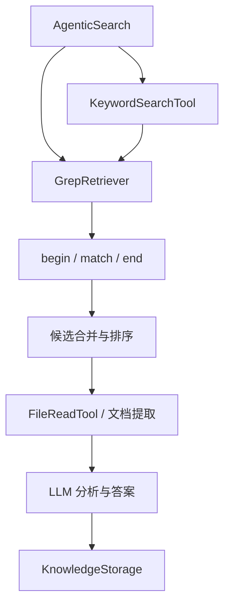
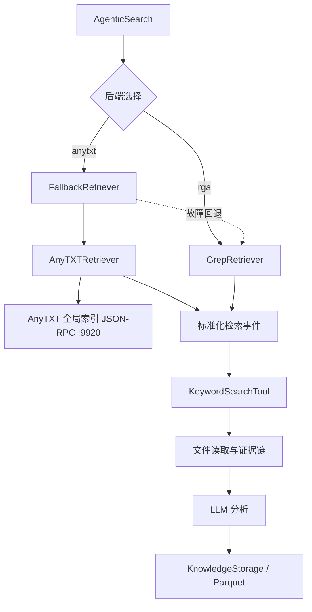

# AnySirchmunk 技术方案

## 1. 方案结论

AnyTXT 应作为 Sirchmunk 的一个可选检索后端接入，而不是位于 Sirchmunk 之外先搜索、再把结果手工交给另一个程序。

Sirchmunk 的检索事件结构是适配入口，但输出相同事件并不足以证明下游兼容。还需验证路径默认值、无行号片段、排序、工具注册及知识复用等调用契约。第一阶段以保持证据链和知识 schema 为目标，允许为全局搜索调整主链路的范围传递和提前返回条件。

## 2. 当前系统边界

Sirchmunk 当前的关键调用关系为：



检索器在以下位置被复用：

- FAST 模式的逐关键词候选检索与正则回退。
- DEEP 模式初始关键词探测。
- DEEP ReAct 循环中的 `KeywordSearchTool`。
- 独立的文件名搜索。

知识持久化位于检索链下游，核心文件为：

- `src/sirchmunk/schema/knowledge.py`
- `src/sirchmunk/storage/knowledge_storage.py`

因此第一阶段不需要改动知识 schema 或 Parquet 写入逻辑。

## 3. 目标架构



建议以组合方式实现回退，而不是让 `AnyTXTRetriever` 继承 `GrepRetriever`。两者只是输出契约一致，底层能力和错误语义不同；组合可以避免意外继承替换、文件修改等与搜索无关的方法。

## 4. 模块设计

### 4.1 AnyTXT RPC 客户端

建议新增：

```text
src/sirchmunk/retrieve/anytxt_retriever.py
```

内部职责分成两个类：

```python
class AnyTXTClient:
    async def search(...): ...
    async def get_fragment(...): ...

class AnyTXTRetriever(BaseRetriever):
    async def retrieve(...): ...
    def merge_results(...): ...
```

`AnyTXTClient` 只负责 JSON-RPC、超时和响应校验。`AnyTXTRetriever` 负责 Sirchmunk 参数语义、路径过滤、去重和输出转换。

可以使用 Python 标准库 HTTP 客户端并通过 `asyncio.to_thread` 包装，避免仅为本机 RPC 增加发布依赖；如果仓库已有稳定的异步 HTTP 依赖，也可以复用。最终实现前应以项目依赖和取消行为测试结果决定。

### 4.2 RPC 调用

已验证的搜索方法：

```json
{
  "method": "ATRpcServer.Searcher.V1.GetResult",
  "input": {
    "pattern": "搜索词",
    "filterDir": "",
    "filterExt": "",
    "lastModifyBegin": 0,
    "lastModifyEnd": 2147483647,
    "limit": 300,
    "offset": 0,
    "order": 0
  }
}
```

响应会给出字段描述及文件记录，当前验证到的字段为 `fid`、`lastModify`、`size` 和 `file`。

片段方法：

```json
{
  "method": "ATRpcServer.Searcher.V1.GetFragment",
  "input": {
    "fid": "搜索结果中的文件标识",
    "pattern": "搜索词"
  }
}
```

匹配文本从响应的 `output.text` 读取。

RPC 地址、请求限制和超时都由配置提供。未显式指定搜索范围时，使用空 `filterDir` 查询 AnyTXT 全局索引。用户明确指定一个或多个根目录时，每个根目录分别请求，结果再按规范化后的绝对路径去重。

本机 1.3.2477 实测中，空字符串可以全局搜索，`"*"` 返回零结果；官方论坛示例则使用 `"*"`。这属于 Beta API 的版本或环境差异，不能把论坛示例直接硬编码。详细记录见 [anytxt-capabilities.md](anytxt-capabilities.md)。

### 4.3 事件转换

每个有效文件转换为一组事件：

```json
{
  "type": "begin",
  "data": {"path": {"text": "D:\\OneDrive\\paper.pdf"}},
  "_search_backend": "anytxt"
}
```

```json
{
  "type": "match",
  "data": {
    "path": {"text": "D:\\OneDrive\\paper.pdf"},
    "lines": {"text": "AnyTXT 返回的命中片段"}
  },
  "score": 1.0,
  "_search_backend": "anytxt"
}
```

```json
{
  "type": "end",
  "data": {"path": {"text": "D:\\OneDrive\\paper.pdf"}},
  "_search_backend": "anytxt"
}
```

AnyTXT 片段没有可靠行号时不伪造 `line_number`。上述事件为目标示例；无行号片段能否被固定版本的排序、读取和证据保存链正确消费，必须通过契约测试确认。片段只用于候选发现，不能代替完整文本的匹配验证。

### 4.4 参数映射

| Sirchmunk 参数 | AnyTXT/适配层行为 |
| --- | --- |
| `terms` | 单词按已验证的 literal/regex 语义搜索；多个词按已确认的 `logic` 语义组合 |
| `path` | 未明确限定时使用空 `filterDir` 全局搜索；明确限定时每个根目录对应一次请求 |
| `case_sensitive` | 仅在原生语义已验证或完整文本可等价验证时支持；否则按范围契约回退或报不支持 |
| `literal` | 使用经过正反例验证的字面量编码；未确认转义规则时，不直接传入含正则符号的词 |
| `regex` | 仅支持已验证的语法子集；未知或不兼容时按范围契约回退或报不支持，不降级为普通词 |
| `max_depth` | 对返回的绝对路径做相对层级过滤 |
| `include` / `exclude` | 用 Windows 路径和文件名进行 glob 后过滤 |
| `count_only` | 先核对固定上游版本的计数单位；只有完整结果和等价单位才返回精确计数，否则回退或报不支持 |
| `timeout` | 整次 retrieve 的总预算，覆盖排队、分页、片段和回退；每次 RPC 受剩余预算限制 |

先确认上游 `logic` 是文件级还是行级语义；文件集合运算不能替代行级匹配。对于已确认的文件级语义，OR 可返回标记为不完整的候选并集；AND 和 NOT 必须取得所有相关查询的完整集合后运算。集合不完整时返回 `incomplete_results`，按范围契约回退或报告无法准确执行，不将截断集合视为完整结果。第一版不实现通过片段推断否定条件；完整文本逐候选验证属于后续优化。

### 4.4A 分页与完整性

- `ANYTXT_SEARCH_LIMIT` 是页大小，不是总候选上限；初始兼容值为 300。实现前验证 `offset`、排序和 `count` 的实际语义。
- 分页使用已验证的稳定排序，按实际收到的记录数推进 offset，并按规范化路径去重。只有已验证的结束条件（短页、空页或可信总数）满足，且没有记录丢弃或已知索引变化，才标记完整；完整性仅相对于本次索引查询，不承诺磁盘资料全部已入索引。
- 重复页、分页能力未知、索引变化、达到请求/候选/字符/时间预算、部分 RPC 失败或无效记录都会使结果不完整；禁止无限翻页。无快照保证的接口不得声称计数具有事务一致性。
- 后置过滤在分页过程中执行。第一页全部被过滤掉不能作为零结果的依据；继续请求直到结束或预算耗尽。
- 内部结果携带 `complete`、`truncated`、`reason`、`actual_backend`、`effective_scope`，与事件列表一起传递。用固定版本支持的 metadata/日志承载，不改公开 payload；若现有工具会丢失状态，需修正内部传递后再验收。
- 区分完整零结果、不完整候选、后端失败和不支持的查询。片段请求按 `(fid, pattern)` 去重，不能仅按文件去重而丢失其他词的片段。

AnyTXT 1.3.2477 的图形界面和本地资源明确提供正则搜索，本机 RPC 对若干正则形式也能返回结果，但公开的 `GetResult` 输入没有独立 `searchType` 字段。适配器需要以受控查询验证当前 RPC 状态，不能假定 GUI 选项与 RPC 始终同步。

### 4.5 能力探测

适配器为每个 AnyTXT 运行实例维护一份短期能力记录：

1. 验证端口和 JSON-RPC 基本响应结构，健康检查不等于语义验证。
2. 第一版使用已验证的 1.3.2477 兼容配置，空 `filterDir` 表示全局；未知版本不凭零结果自动切换到 `"*"`。
3. 对目录、分页、字面量和正则分别记录 `verified`、`unsupported` 或 `unknown`，并保存验证依据；版本无法读取时记为未知，不推断版本号。
4. 自动语义探测仅使用已知内容、确认已入索引的非私人测试文件，运行命中和不命中的对照查询。启动健康检查不自动创建文件或修改索引配置。
5. 没有测试语料时保持未知；需要未知能力的请求按范围契约回退或返回 `unsupported_query`。实例重启、版本或模式变化后使相关缓存失效。

能力探测不能依赖某个词在用户语料中必然存在。模拟 RPC 用于测试状态机，不能证明真实服务语义。普通实际查询返回零条或若干结果，也不能单独把未知能力升级为已验证。

### 4.6 后端选择与回退

`AgenticSearch.__init__` 根据配置构造统一的关键词检索器：

```python
backend = os.getenv("SIRCHMUNK_SEARCH_BACKEND", "rga")
```

- `rga`：创建现有 `GrepRetriever`。
- `anytxt`：创建 `AnyTXTRetriever`，按配置决定故障时是否包装 `GrepRetriever` 回退。
- `auto`：后续可增加健康检查后自动选择；第一阶段可以暂不暴露，避免模糊的运行行为。

回退针对后端故障、单次 RPC 超时、不支持的查询能力，以及要求精确语义但结果不完整的请求。完整零结果直接返回空结果。取消和总预算耗尽不启动回退；每次 retrieve 最多回退一次。

范围契约如下（仅适用于 `anytxt` 模式，`rga` 默认行为不变）：

| 请求范围 | `rga` 回退与文件名枚举 |
| --- | --- |
| 显式根目录 | 仅使用这些目录并保留 include/exclude/max_depth；不得扩展到配置根目录 |
| 全局索引，配置了 `ANYTXT_FALLBACK_ROOTS` | 仅使用配置根目录并保留过滤规则，标记 `scope_reduced=true`，明确结果仅覆盖这些目录 |
| 全局索引，未配置回退根目录 | 不执行枚举或回退；按原因返回 backend_unavailable、unsupported_query 或 incomplete_results |

`ANYTXT_FALLBACK_ROOTS` 是绝对目录组成的 JSON 数组，默认 `[]`；无效路径或配置应报配置错误，不替换为当前目录或所有磁盘。全局模式使用文件名枚举但没有根目录时，报告 `scope_required`；可选的 FAST 文件名步骤跳过并记录原因。所有内容检索回退均受 `ANYTXT_FALLBACK_TO_RGA` 开关控制，文件名枚举不受该开关控制。

在入口区分“未提供范围”和“显式范围”，将同一个内部 scope 传至 FAST、DEEP、ReAct、文件读取和知识复用；禁止中途用工作目录补全全局范围。显式范围还应在读取前校验解析后的真实路径，覆盖 Windows 大小写、分隔符和目录联接。

检索器属性可以在过渡期继续使用现有名称，以减少主链路改动；第一版将类型从具体 `GrepRetriever` 改为明确的只读检索协议，方法与返回契约在固定上游版本上验证。

### 4.7 文件名搜索

当前 `retrieve_by_filename` 依赖 `rga --files` 枚举目录。第一阶段继续单独保留一个 `GrepRetriever` 用于 `FILENAME_ONLY` 和 FAST 的最终文件名回退，并严格遵守 4.6 的范围契约。

这意味着“内容检索使用 AnyTXT”与“文件名枚举使用 rga”可以同时存在。日志必须明确区分，避免用户误以为整次查询都经过 AnyTXT。

### 4.8 知识存储

AnyTXT 只改变候选文件的发现方式。候选文件进入 Sirchmunk 后，仍由现有流程创建 `EvidenceUnit` 和 `KnowledgeCluster`，并通过 `KnowledgeStorage` 写入：

```text
{SIRCHMUNK_WORK_PATH}/.cache/knowledge/knowledge_clusters.parquet
```

不在 AnyTXT 索引中写入 Sirchmunk 的答案或知识簇，也不复制 AnyTXT 索引文件。这样可以保持职责清楚，并允许随时切回 `rga`。

## 5. 预计改动范围

### 5.1 上游基线与交付方式

第一阶段采用针对固定 Sirchmunk commit 的补丁集，由 AnySirchmunk 管理补丁、安装说明和测试；不要求用户直接跟随上游 main。当前锁定 commit 为
`3c7ee54f93fa198db2020a3ab850356f2dacff72`（Apache-2.0，Python >=3.10）。
验证环境为 Python 3.14.3；上游 `requirements/core.txt` 与
`requirements/tests.txt` 的 SHA-256 记录在 `baseline.json`。安装、验证和反向应用
补丁的命令由 `scripts/apply.ps1`、`scripts/verify.ps1` 和
`scripts/rollback.ps1` 提供。

2026-09-14 方案审查参考的[上游 search.py](https://github.com/modelscope/sirchmunk/blob/main/src/sirchmunk/search.py)中，DEEP 的 `_react_explore_files` 存在空路径直接返回分支。这说明不能仅替换构造函数便宣称全局搜索已接通；该链接为可变参考，不构成锁定基线。

在固定版本上建立调用矩阵，逐项覆盖“全局/显式范围 × FAST/DEEP 初始检索/ReAct/文件名搜索/知识复用”，检查默认路径填充、空路径提前返回、工具注册、事件合并、无行号读取和 metadata 传递。只读检索协议在第一版确定，包含所需方法、返回类型和异常语义，不只替换类型提示。

### 5.2 文件范围

在 Sirchmunk 上游代码中实施时，预计涉及：

| 文件 | 变更 |
| --- | --- |
| `src/sirchmunk/retrieve/anytxt_retriever.py` | 新增 RPC 客户端、检索适配和结果转换 |
| `src/sirchmunk/search.py` | 构造检索器；传递 scope；修正阻断全局搜索的分支；保留文件名检索器 |
| `src/sirchmunk/agentic/tools.py` | 使用只读检索协议；传递 scope 和完整性状态；保持公开工具输出兼容 |
| `config/env.example` | 说明 AnyTXT 配置 |
| `src/sirchmunk/cli/cli.py` | 让新初始化的 `.env` 包含非默认启用的配置说明 |
| 测试目录 | 增加模拟 RPC 和搜索链集成测试 |

不计划改动知识 schema、Parquet 文件结构、HTTP/MCP payload 或 Web 路由。

## 6. 验证计划

### 单元验证

- 正常搜索响应转换为完整的事件组。
- 空 `filterDir` 的全局搜索和显式目录搜索分别按预期工作。
- 模拟不同版本对空字符串和 `"*"` 的处理，验证兼容选择不会污染实际搜索结果。
- 多目录结果按绝对路径去重。
- `include`、`exclude` 和 `max_depth` 正确过滤。
- AND、OR、NOT 的文件集合结果正确。
- 缺少字段、非法 JSON、超时和连接拒绝产生稳定错误。
- 正常零结果不会触发故障回退。
- 后端故障在启用配置时回退，并写入 `_fallback_reason`。
- 超过 300 条的 AND/NOT 用例包含第 301 条之后的交集与排除项；截断时不得返回伪精确结果。
- 第一页全部被过滤、重复页、无效记录、分页过程中索引变化均按完整性契约处理。
- `a.b`、`C++`、括号、反斜杠和大小写正反例；原文有匹配而片段没有时不得据片段判否。
- 有/无回退根目录、显式范围、关闭回退、取消与总预算耗尽分别验证；检查没有隐式扫描当前目录或整盘。
- 无已知测试文件时能力保持 unknown；模拟测试与真实能力验证分别报告。

### 集成验证

- 使用本机 AnyTXT 搜索一组已知 PDF，核对文件路径和片段。
- 运行 Sirchmunk FAST 查询，确认候选文件来自 AnyTXT，答案可引用原文件。
- 运行一次受控的 DEEP 查询，确认初始探测和 ReAct 关键词工具都使用适配器。
- 查询后检查知识簇已经写入并能再次读取。
- 停止 AnyTXT 服务后验证 `rga` 回退。
- 设置 `SIRCHMUNK_SEARCH_BACKEND=rga`，验证原行为未发生回归。
- 执行 5.1 的完整调用矩阵，特别验证无路径 DEEP/ReAct 不会在调用适配器前退出。

### 性能与召回基准

使用固定的非私人测试语料和至少 30 个查询，覆盖中英文、常见/稀有词、PDF/DOCX/TXT、范围过滤及超过一页的结果；人工标注目标文件集。记录语料清单、查询和上游 SHA，确认两个后端在同一目录范围测试。每个查询分别执行冷缓存一次、预热后五次，冷/热结果分开统计。

记录候选 recall@K（相同 K）、检索阶段 P50/P95、RPC 次数、片段字符数、完整性、回退率；LLM 答案总时延另列。暂定发布门槛：共同支持的查询集上 AnyTXT 平均 recall@K 不低于 rga，热缓存检索 P95 不高于 rga 的 80%；精确语义测试全部通过。该门槛是待实测的目标，不是已达到的性能结论；调整需注明原因，不能在失败后直接宣称通过。

所有请求共享预算：默认单次 RPC 5 秒、整次 retrieve 30 秒、并发 4、总 RPC 100、候选文件 3000、片段 100000 字符。能力探测、所有关键词与目录、分页、片段及回退均计入适用预算；每次 RPC 超时取配置的单次超时与剩余预算较小值，调用方 timeout 与配置总预算取较小值。预算值均可配置，名称与默认值见需求 FR-8；并发由共享信号量约束。单次 retrieve 的预算不代表整个多轮 DEEP 查询预算，外层取消或截止时间也须向下传递。线程包装 HTTP 时取消不能强制终止已运行线程，必须验证连接超时和资源释放，并停止提交新请求。

### 工程检查

- 对新增和修改的 Python 文件运行 `py_compile`。
- 运行相关单元测试和现有最接近的检索测试。
- 审查 Git diff，确保不包含 API key、用户文献内容或真实私人路径。

## 7. 风险与处理

| 风险 | 处理方式 |
| --- | --- |
| AnyTXT API 版本变化 | 集中封装 RPC；启动时进行轻量能力检查；保留 `rga` |
| 片段没有行号 | 使用 Sirchmunk 现有无行号片段路径，并从原文件提取更多证据 |
| AnyTXT 返回搜索范围外文件 | 以解析后的绝对路径进行强制根目录校验 |
| 结果上限造成漏召回 | 验证分页；传递完整性；不对截断集合执行精确 AND/NOT/计数 |
| 全局目录参数语义变化 | 优先使用当前版本验证值；能力探测其他兼容形式；记录所选策略 |
| 正则语义或模式状态不一致 | 已知语料正反例验证；未知时按范围回退或报不支持 |
| 多设备同步冲突 | 第一阶段限定单写者；文档说明同步顺序 |
| 上游 Sirchmunk 更新 | 适配器保持小接口；集成改动单独提交，便于重放和比较 |

## 8. 回滚

运行时回滚：

```dotenv
SIRCHMUNK_SEARCH_BACKEND=rga
```

代码回滚可以移除 AnyTXT 适配器和后端工厂改动。由于方案不改变知识 schema、API payload 或 AnyTXT 索引，回滚后已有知识数据仍可由原版 Sirchmunk 读取。

## 9. 后续选择

第一阶段按三个可验证里程碑推进：

1. 锁定上游与契约，完成单个已验证字面量关键词 → AnyTXT → FAST → 原文引用的闭环。
2. 完成分页、过滤、完整性和有界回退，验证多词与不支持语义的处理。
3. 接通 DEEP/ReAct、知识复用和文件名范围矩阵，完成性能基准后再发布。

如果 Sirchmunk 上游结构变化过大或无法稳定注入检索器，第二方案是在 AnySirchmunk 中实现独立协调服务：它调用 AnyTXT 查找文件，读取证据并建立自己的知识存储。该方案需要重新实现知识聚类、合并、来源追踪和多轮复用，维护成本明显更高，因此只作为后备路线。
